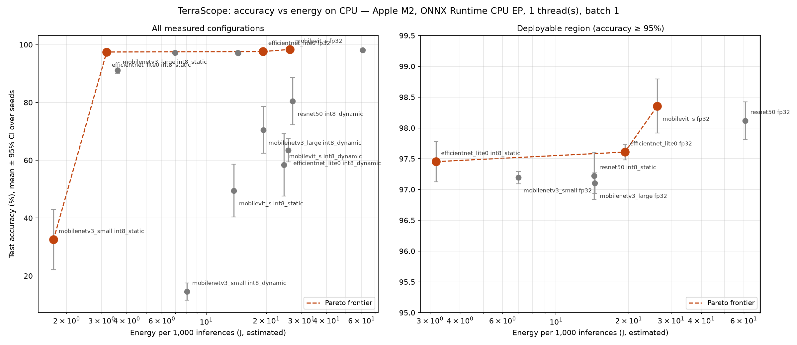

# TerraScope — the accuracy–energy trade-off for land-cover classification on CPU-only hardware

[](https://github.com/eklavya072/TerraScope-GeoSpatial-AI/actions/workflows/ci.yml)
[](https://terrascope.streamlit.app)
[](LICENSE)
[](LICENSE-DATA)
[-green)](https://github.com/phelber/eurosat)

## The finding

On EuroSAT, replacing ResNet-50 (fp32) with EfficientNet-Lite0 (int8, statically
quantised) costs **0.67 percentage points of accuracy** — 98.12% ± 0.30 against
97.45% ± 0.32 — while using **19× less energy per inference** (60.84 J against
3.18 J per 1,000 images), running **28× faster** (12.24 ms against 0.43 ms p95)
and occupying **25× less disk** (94.0 MB against 3.8 MB).

Accuracy differences between architectures are real but small — a 1.25 pp spread
across five architectures, of which 8 of 10 pairwise comparisons survive
Holm-Bonferroni correction — whereas energy spans a factor of 19. **On CPU-only
hardware the deployment decision should therefore be made on energy and latency,
not on accuracy.**

Every number in this repository comes from a run we executed on the hardware
recorded below, against a split file committed to this repository. Energy is
**estimated** from on-die power telemetry, not metered at the wall; see
[Limitations](#limitations).

---

## Results

<!-- BEGIN:results_table -->
### Results (ONNX Runtime CPU EP, intra-op threads=1, batch=1)

Accuracy is the mean over 5 seeds with a Student-t 95% confidence interval. Energy figures are ESTIMATED from on-die power telemetry, not metered at the wall. CO2e assumes 481 gCO2e/kWh (world average grid carbon intensity, ~481 gCO2e/kWh).

| Model | Precision | Params | Accuracy % (mean ± 95% CI) | p95 latency (ms) | Model RSS (MB) | Model (MB) | Energy/1k inf (J, estimated) | CO2e/1M inf (g, estimated) |
|---|---|---:|---:|---:|---:|---:|---:|---:|
| efficientnet_lite0 | fp32 | 3.38M | 97.61 ± 0.13 | 3.74 | 31 | 13.5 | 19.28 | 2.58 |
| efficientnet_lite0 | int8_dynamic | 3.38M | 63.44 ± 3.97 | 4.43 | 19 | 3.6 | 25.75 | 3.44 |
| efficientnet_lite0 | int8_static | 3.38M | 97.45 ± 0.32 | 0.43 | 17 | 3.8 | 3.18 | 0.42 |
| mobilenetv3_large | fp32 | 4.21M | 97.10 ± 0.17 | 2.73 | 35 | 16.8 | 14.46 | 1.93 |
| mobilenetv3_large | int8_dynamic | 4.21M | 70.47 ± 8.10 | 2.88 | 19 | 4.4 | 19.32 | 2.58 |
| mobilenetv3_large | int8_static | 4.21M | 91.10 ± 1.11 | 0.52 | 21 | 4.7 | 3.60 | 0.48 |
| mobilenetv3_small | fp32 | 1.53M | 97.19 ± 0.10 | 1.40 | 18 | 6.1 | 6.97 | 0.93 |
| mobilenetv3_small | int8_dynamic | 1.53M | 14.57 ± 2.95 | 1.54 | 14 | 1.7 | 8.02 | 1.07 |
| mobilenetv3_small | int8_static | 1.53M | 32.53 ± 10.40 | 0.32 | 19 | 1.9 | 1.72 | 0.23 |
| mobilevit_s | fp32 | 4.94M | 98.36 ± 0.44 | 4.46 | 37 | 20.0 | 26.31 | 3.51 |
| mobilevit_s | int8_dynamic | 4.94M | 58.41 ± 10.82 | 3.91 | 30 | 5.5 | 24.53 | 3.28 |
| mobilevit_s | int8_static | 4.94M | 49.50 ± 9.13 | 2.11 | 28 | 5.8 | 13.77 | 1.84 |
| resnet50 | fp32 | 23.53M | 98.12 ± 0.30 | 12.24 | 162 | 94.0 | 60.84 | 8.13 |
| resnet50 | int8_dynamic | 23.53M | 80.49 ± 8.15 | 5.36 | 39 | 23.7 | 27.08 | 3.62 |
| resnet50 | int8_static | 23.53M | 97.22 ± 0.38 | 2.49 | 67 | 24.0 | 14.39 | 1.92 |
<!-- END:results_table -->

**ONNX export is accuracy-neutral.** All 25 exported fp32 graphs reproduce their
PyTorch checkpoint's test accuracy *exactly* — 25/25 identical, maximum
difference 0.000000 pp. This matters because latency and energy are measured on
the exported graph while accuracy is attributed to the model: if export drifted,
every row would be describing two different models in the same line. It is
asserted as a test (`tests/test_results_integrity.py`), not just observed once.

Both int8 columns matter. **Static quantisation is close to free for some
architectures and catastrophic for others**, which means "quantise it for the
edge" is not a safe default:

<!-- BEGIN:quantisation -->
### Accuracy cost of int8 quantisation

Paired per-seed differences against each model's own fp32 export, mean with a Student-t 95% confidence interval. Negative means quantisation lost accuracy.

| Model | Precision | fp32 % | int8 % | Δ (pp, mean ± 95% CI) |
|---|---|---:|---:|---:|
| efficientnet_lite0 | int8_dynamic | 97.61 | 63.44 | -34.17 ± 4.07 |
| efficientnet_lite0 | int8_static | 97.61 | 97.45 | -0.16 ± 0.23 |
| mobilenetv3_large | int8_dynamic | 97.10 | 70.47 | -26.63 ± 8.12 |
| mobilenetv3_large | int8_static | 97.10 | 91.10 | -6.01 ± 1.08 |
| mobilenetv3_small | int8_dynamic | 97.19 | 14.57 | -82.62 ± 2.92 |
| mobilenetv3_small | int8_static | 97.19 | 32.53 | -64.66 ± 10.34 |
| mobilevit_s | int8_dynamic | 98.36 | 58.41 | -39.94 ± 11.18 |
| mobilevit_s | int8_static | 98.36 | 49.50 | -48.86 ± 9.28 |
| resnet50 | int8_dynamic | 98.12 | 80.49 | -17.63 ± 7.89 |
| resnet50 | int8_static | 98.12 | 97.22 | -0.90 ± 0.50 |
<!-- END:quantisation -->

EfficientNet-Lite0 loses **0.16 ± 0.23 pp** to static int8 — a confidence
interval containing zero, so on this dataset its quantised form is statistically
indistinguishable from its fp32 parent while using 6× less energy. ResNet-50
loses 0.90 ± 0.50 pp. MobileNetV3-Small loses 64.66 pp and MobileViT-S 48.86 pp:
post-training quantisation destroys them. We investigated this rather than
reporting it blind — per-channel weights, min-max / percentile / entropy
calibration, restricting quantisation to Conv/Gemm, excluding depthwise
convolutions, signed and unsigned activations, and batch sizes 1 and 64 all fail
to recover MobileNetV3-Small. Its hard-swish and squeeze-excite activation
distributions are the textbook case that post-training quantisation cannot
represent; recovering them requires quantisation-aware training, which is out of
scope for a post-training benchmark.

**int8 dynamic quantisation is strictly dominated** on this hardware — worse
accuracy *and* worse energy than fp32 for every model in the zoo. It recomputes
activation ranges on every call, and ONNX Runtime's dynamic path handles
convolutions poorly. It is reported because a negative result that saves someone
else the experiment is worth publishing.

### Is the energy column just the latency column in different units?

A fair objection, and worth answering with the data rather than deflecting.
Energy per inference is power × time, so if package power were constant across
configurations the energy axis would carry no information that latency does not.

At a fixed thread count it is *mostly*, but not entirely, latency. Across all 75
measurement windows at 1 thread, batch 1 (15 model × precision configurations ×
5 seeds):

| Quantity | Range | Ratio |
|---|---|---|
| p50 latency | 0.251 → 12.239 ms | 48.8× |
| Energy per 1,000 inferences | 1.56 → 63.12 J | 40.5× |
| Mean package power | 4.86 → 10.24 W | **2.1×** |

Energy correlates with latency at **r = 0.983**. So most of the energy spread is
the latency spread, and we say so plainly rather than implying two independent
findings.

What the remaining 2.1× buys is not nothing:

- **Quantised models draw systematically more power.** Mean package power is
  5.51 W for fp32, 6.16 W for int8-dynamic and **6.95 W for int8-static** — a 26%
  increase for static int8 over fp32. Quantisation does not simply make the same
  work shorter; it makes the CPU work harder while it runs. A latency-only
  reading would overstate int8's energy advantage.
- **It reorders one pair.** Ranked by latency, `mobilenetv3_large int8_dynamic`
  beats `efficientnet_lite0 fp32`; ranked by energy, the order reverses. One
  swap in fifteen is a small effect, and reporting it as small is the honest
  framing.
- **Across thread counts the two decouple properly.** Package power spans 3.7×
  among the 4-thread windows (4.78 → 17.76 W) against 2.1× at 1 thread. That is
  where latency alone genuinely misleads about energy — and, as documented above,
  it is also where core placement confounds the comparison, so we draw no
  cross-model conclusion from it.

The honest summary: **on this hardware, at a fixed thread count, energy is
largely a restatement of latency, with a real but second-order power term that
matters most when comparing precisions.** The energy axis earns its place
because the deployment question is energy, and because the power term moves in
the opposite direction to the intuition that int8 is uniformly cheaper — but it
is not an independent axis, and this README does not claim it is.

### Accuracy: which differences are real?

<!-- BEGIN:significance -->
### Which accuracy differences are statistically distinguishable?

Welch's t-test over seeds, Holm-Bonferroni corrected across all pairwise comparisons (family-wise alpha = 0.05).

| Comparison | Δ accuracy (pp) | p | Holm threshold | Distinguishable? |
|---|---:|---:|---:|---|
| efficientnet_lite0 vs mobilenetv3_small | +0.41 | 0.0001 | 0.0050 | **yes** |
| mobilenetv3_large vs resnet50 | -1.01 | 0.0001 | 0.0056 | **yes** |
| efficientnet_lite0 vs mobilenetv3_large | +0.50 | 0.0002 | 0.0063 | **yes** |
| mobilenetv3_small vs resnet50 | -0.93 | 0.0005 | 0.0071 | **yes** |
| mobilenetv3_large vs mobilevit_s | -1.25 | 0.0006 | 0.0083 | **yes** |
| mobilenetv3_small vs mobilevit_s | -1.16 | 0.0014 | 0.0100 | **yes** |
| efficientnet_lite0 vs resnet50 | -0.51 | 0.0063 | 0.0125 | **yes** |
| efficientnet_lite0 vs mobilevit_s | -0.75 | 0.0073 | 0.0167 | **yes** |
| mobilenetv3_large vs mobilenetv3_small | -0.09 | 0.2480 | 0.0250 | no |
| mobilevit_s vs resnet50 | +0.24 | 0.2565 | 0.0500 | no |

8 of 10 pairwise accuracy differences are statistically distinguishable after correction.
<!-- END:significance -->

Two cautions on reading that table. First, *statistically distinguishable* is not
*operationally meaningful*: the entire spread from best to worst architecture is
1.25 pp, and a difference can be reliable yet too small to justify any change in
deployment. Second, the comparisons are between architectures under one fixed
recipe and one fixed budget — a model that trains poorly here might do better
with tuning it was deliberately not given.

### Accuracy versus energy



The marked frontier is the true mathematical one, so it includes
`mobilenetv3_small int8_static` purely because nothing is cheaper — at 32.5%
accuracy that configuration is useless in practice. Restricted to configurations
above 97% accuracy, the frontier is **EfficientNet-Lite0 int8_static** (97.45%,
3.18 J/1k), then **ResNet-50 int8_static** (97.22%, 14.39 J/1k) is dominated by
it, and **MobileViT-S fp32** (98.36%, 26.31 J/1k) buys the last 0.9 pp for 8.3×
the energy.

### Deployment recommendation

For a CPU-only ministry server classifying Sentinel-2 RGB tiles, deploy
**EfficientNet-Lite0 quantised to int8 with static calibration**. It costs 0.67 pp
of accuracy against the ResNet-50 fp32 baseline and 0.90 pp against the most
accurate model measured (MobileViT-S fp32), in exchange for 19× less energy, 28× lower p95 latency,
and a 3.8 MB artefact that fits comfortably in a constrained deployment. On a single
thread it sustains roughly 2,300 images per second (0.43 ms p95), and its 17 MB
resident footprint leaves the machine free for the rest of its work. If the last 0.9 pp of accuracy genuinely matters —
which, given the dataset caveats below, should be argued rather than assumed —
MobileViT-S in fp32 is the accuracy-optimal choice at 8.3× the energy. Do **not**
deploy a quantised MobileNetV3 or MobileViT without quantisation-aware training:
their post-training int8 accuracy is unusable.

### Measurement protocol and exclusions

Rejection criteria for measurement windows were **committed before any
measurement was taken** — `bd06ff5` (26 Aug 2026) introduced
[PROTOCOL.md](PROTOCOL.md) and `bench/exclusion.py`; `1c9fa33` (2 Sep 2026) is
the first commit carrying `results/bench.jsonl`. Seven days, and the ordering is
checkable with `git log bd06ff5..1c9fa33`. Deciding which windows to discard
after seeing the numbers would be post-hoc selection.

**4 of 300 windows were excluded** — two for latency p95/p50 > 1.50 (contention),
two for energy sample coverage below 0.95. None fall in the primary reporting
configuration, so no headline figure changes when they are removed; this was
verified by recomputing the summary both ways. The excluded rows remain in
`results/bench.jsonl` and are listed in `results/summary.json`; nothing is
deleted. PROTOCOL.md also records five deviations from the original
pre-registration, including two criteria that were never instrumented and the
fact that failing windows were not re-run.

Energy is reported **gross**, not baseline-subtracted. The idle baseline measured
over 338 s immediately after the matrix was 0.036 W, which is 0.78% of the
lowest-power measurement window and less for every other one — so baseline
subtraction would move no figure by more than 0.78%, well inside the reported
seed-to-seed variation.

---

## Reproducing this

```bash
make setup     # install the locked environment (uv + uv.lock)
make data      # fetch EuroSAT, write data/eurosat_rgb/MANIFEST.sha256
make split     # regenerate the committed split (verifies byte-identical)
make train     # 5 architectures x 5 seeds under one recipe
make export    # ONNX fp32 + int8 dynamic/static for all 25 checkpoints
make bench     # latency, memory and energy matrix
make report    # rebuild tables, Pareto figure, and this README's tables
```

`make all` runs the whole pipeline. Training uses the GPU where one is available
(MPS on this machine) purely to make the matrix tractable; **all benchmarking is
CPU-only** and no reported figure depends on the training device.

Energy measurement requires a privileged sampler running alongside the benchmark,
because Apple Silicon exposes on-die power only to root:

```bash
sudo ./scripts/energy_sampler.sh
```

Start it before `make bench` and leave it running. Without it the benchmark still
records accuracy, latency and memory, and reports every energy column as null
rather than substituting an estimate.

### Tests

```bash
uv sync --frozen --group dev
uv run pytest tests/ -v
```

58 tests, no GPU and no dataset download required — they run against the
committed split and the committed results, so CI verifies the artefacts that
actually ship. Coverage is deliberately weighted towards the failures this
project has actually had:

- **Split integrity** — hash matches its sidecar, fold sizes, stratification
  within 1% per class, and no tile in two folds.
- **Energy integration** — three regression tests for real bugs: parsing the log
  once while the sampler appends (would have nulled every energy figure),
  integrating across second-quantised timestamps (returned exactly 0 J), and
  partial trailing lines during a concurrent write.
- **Statistics** — that `mean_ci` uses the t distribution rather than z (with
  n=5 the difference is ~30% of the interval width), and that Holm correction
  actually suppresses ten p=0.04 comparisons.
- **Results invariants** — one split hash and one recipe hash across every row,
  5 seeds per model, uniform measurement conditions (AC, Low Power Mode off, one
  ONNX Runtime version), and ONNX/PyTorch accuracy agreement on all 25 exports.
- **Internal consistency of `summary.json`** — the machine-readable artefact
  deposited under the DOI must not contradict itself, e.g. a regime note that
  says "confounded" beside a flag that says clean.
- **README claims** — every headline number is re-derived from `summary.json`
  and checked against the prose. This exists because a hand-typed sentence once
  claimed a 4-thread result that was wrong in both magnitude and direction while
  the generated tables beside it were correct.

### What makes this reproducible

- **The split is committed.** EuroSAT ships no official train/test partition, so
  every published EuroSAT figure is measured against folds the reader cannot see.
  `splits/eurosat_split_seed42.csv` is generated deterministically from seed 42,
  verified byte-identical across runs and `PYTHONHASHSEED` values, and referenced
  by sha256 in every result row. Runs abort if it does not match its sidecar hash.
- **The corpus is hashed.** `data/eurosat_rgb/MANIFEST.sha256` records a sha256
  per tile, written from undecoded bytes so the files are byte-identical to
  upstream.
- **The recipe is hashed** into every result, so a silent change is detectable
  after the fact.
- **The environment is pinned**, `torch==2.9.1` and `onnxruntime==1.29.0` exactly,
  because latency and energy are only comparable within a fixed runtime version.
  Linux resolves the same version from PyTorch's CPU index (`2.9.1+cpu`), which
  avoids ~3 GB of CUDA runtime this CPU-only benchmark would never load.

<!-- BEGIN:recipe -->
Every architecture is trained under this identical recipe. There is no
supported way to give one model a tuned recipe of its own.

| Setting | Value |
|---|---|
| augmentation | `['random_hflip', 'random_vflip', 'random_rot90']` |
| batch_size | `128` |
| early_stopping | `{'mode': 'max', 'monitor': 'val_acc', 'patience': 4, 'restore_best_weights': True}` |
| finetune | `full` |
| input_size | `64` |
| label_smoothing | `0.1` |
| lr | `0.0003` |
| max_epochs | `20` |
| norm_mean | `[0.485, 0.456, 0.406]` |
| norm_std | `[0.229, 0.224, 0.225]` |
| optimizer | `adamw` |
| schedule | `cosine` |
| warmup_epochs | `2` |
| weight_decay | `0.0001` |
<!-- END:recipe -->

---

## Hardware and measurement conditions

<!-- BEGIN:hardware -->
All measurements in this repository come from ONE machine. Latency,
memory and energy figures are properties of the model AND this hardware;
they are not portable claims.

| Property | Value |
|---|---|
| CPU | Apple M2 |
| Cores | 8 physical / 8 logical |
| RAM | 8 GiB |
| OS | Darwin 23.6.0 (Darwin Kernel Version 23.6.0) |
| Python | 3.12.11 |
| PyTorch | 2.9.1 |
| ONNX Runtime | 1.29.0 |
| timm | 1.0.28 |
| NumPy | 2.5.2 |
| Measurement date (UTC) | 2026-09-01T17:09:50+00:00 |
| Power source during measurement | AC |
| macOS Low Power Mode | 0 (AC) |
| Training environment (affects no reported figure) | 2026-08-27T01:52:08+00:00, battery |

Split file: `splits/eurosat_split_seed42.csv`  
Split sha256: `b77443792ba4b11439ed220b3dea699ce61e48e0a0af49c51fb6a8cf43b0595d`  
Recipe hash: `746abf440ef1`

Inference is measured through ONNX Runtime's **CPU execution provider only**.
Apple's GPU (MPS) and CoreML providers are excluded deliberately, not merely
left unused: the question is what CPU-only hardware achieves. Training used
the GPU, which affects no reported figure -- training cost is not part of the
deployment claim being made.
<!-- END:hardware -->

Measurement discipline: thread counts are pinned in both the ONNX Runtime session
and the environment (`OMP_NUM_THREADS`, `MKL_NUM_THREADS`, `OPENBLAS_NUM_THREADS`,
`VECLIB_MAXIMUM_THREADS`) — BLAS pools ignore the session setting, and unpinned
thread counts are the most common reason CPU latency fails to reproduce. 50
warm-up inferences are discarded before timing; each configuration is then timed
for at least 1,000 inferences (batch-1 windows ran ≥1,666 calls; batch-32
windows ran ≥100 calls, so ≥3,200 images) and targets a 20-second window,
reported as p50/p95/p99 with variance. The run count is sized from a short probe
of per-call cost, which can undershoot when the probe overestimates it: the
shortest window actually achieved was 16.9 s. Timing reuses one fixed input tensor, so the input is resident in
cache: this isolates model compute from data-loading cost, which is the intent,
but it means the figures are a lower bound on end-to-end serving latency, which
would also carry decode and preprocessing. The whole matrix ran in one session on AC power with Low Power
Mode disabled; `powermetrics` recorded no thermal warning for the duration.

The primary configuration is **1 intra-op thread**, which is both the
reproducible one and what a shared multi-tenant server realistically grants a
single inference process.

⚠️ **The 4-thread rows carry a confound and should not be used for cross-model
comparison.** Their power draw is bimodal — 53 of 150 windows sat near 6 W and
the rest near 15.4 W — and the regime tracks *when* a model was measured, not
which model it was, consistent with macOS scheduling threads onto efficiency
versus performance cores. ResNet-50 and MobileNetV3-Small were measured almost
entirely in the low-power regime (26/30 and 27/30 windows); the other three
entirely in the high-power one. Latency moved with it: for ResNet-50 fp32 at 4 threads,
one window measured 5.25 ms p95 at 16.0 W against four windows averaging 8.0 ms
at 4.9 W — note that the high-power side here is a single window, so treat it as
an illustration of the regime split rather than an estimate of its size. The rows are real
measurements, but of two different machine configurations, so they are shipped
characterised (`thread_regime_confound` in `results/summary.json`) rather than
compared. The 1-thread rows show no such split (minority regime 0.7% of windows),
which is why every headline figure in this README is 1-thread, batch-1.

For reference, within the *same* regime, 4 threads does reduce energy per
inference: MobileNetV3-Small fp32 goes from 6.97 J/1k at 1 thread to 5.84 J/1k
at 4 threads (1.50× faster, 16% less energy) at batch 1, and from 6.64 to
3.06 J/1k (2.19× faster, 54% less energy) at batch 32.

---

## Limitations

- **Single hardware platform.** One Apple M2. Latency and energy rankings may
  differ on x86, on server-class CPUs with AVX-512, or under different memory
  bandwidth. This is the limitation most likely to change a conclusion.
- **Energy is estimated, not metered.** Figures come from Apple Silicon's on-die
  CPU package power telemetry, sampled at 200 ms and integrated over each timed
  window. This excludes DRAM, display and PSU losses and is not a wall-socket
  measurement. `codecarbon` cannot serve as an independent check here: it reads
  Intel RAPL, which Apple Silicon lacks, so it degrades to a hardcoded-TDP model
  whose output is a linear function of runtime — that would be latency wearing a
  different unit, so it is not reported.
- **CO₂e rests entirely on a stated assumption.** Carbon scales linearly with
  assumed grid intensity (481 gCO₂e/kWh here, world average). National grids
  range from under 50 to over 700, a ~15× spread. Substitute your own.
- **EuroSAT is near-saturated**, so architecture differences are small in
  absolute terms even when statistically reliable. Accuracy is a weak
  discriminator on this dataset; that is itself the finding.
- **Geographic bias.** EuroSAT covers 34 European countries. Nothing here
  supports a claim about performance elsewhere; land cover, agriculture,
  settlement morphology and phenology all differ.
- **No scene-level split control.** EuroSAT tiles are cut from larger Sentinel-2
  scenes, and the corpus as redistributed carries no scene identifier. Spatially
  adjacent tiles may therefore span folds, which inflates all accuracies here
  relative to true generalisation to unseen geography. Every model is affected
  equally, so comparisons remain valid, but the absolute numbers should not be
  read as geographic generalisation.
- **RGB only.** EuroSAT's 13-band multispectral form is not benchmarked.
- **One preprocessing convention.** The fairness rule requires identical
  preprocessing, so all five models use ImageNet channel statistics. Four report
  exactly those in their pretraining config; MobileViT's expects raw [0,1]
  inputs, so its numbers carry a caveat the others do not.
- **Early stopping interacts with fast convergence.** MobileViT-S reaches ~98%
  validation accuracy within one epoch; on two of five seeds the patience-4 rule
  fired at epochs 6 and 7. The rule is identical for every model, so the
  comparison is fair, but it explains MobileViT-S's wider confidence interval.
- **Training-time figures mix power regimes.** ResNet-50 seed 0 trained under
  Low Power Mode on battery; the rest did not. Accuracy is unaffected — it comes
  from checkpoints — but `train_seconds` in `results/runs.jsonl` is not
  comparable across rows. No benchmark figure depends on it.

---

## Attribution and licences

Code is MIT ([LICENSE](LICENSE)). Results data and the split file are CC-BY-4.0
([LICENSE-DATA](LICENSE-DATA)). A [datasheet](DATASHEET.md) following *Datasheets
for Datasets* (Gebru et al.) documents the split and results artefacts.

**EuroSAT** is distributed under the MIT licence. Cite:

> Helber, P., Bischke, B., Dengel, A., & Borth, D. *EuroSAT: A Novel Dataset and
> Deep Learning Benchmark for Land Use and Land Cover Classification.*

**Sentinel-2 / Copernicus.** EuroSAT is derived from Copernicus Sentinel-2
imagery. Copernicus data is provided under terms granting free access, including
reproduction, distribution and modification.

**ESA WorldCover** is *not* used in this project, so its attribution string is
deliberately omitted rather than included for completeness — printing an
attribution for data one has not used is a false provenance claim.

---

## Architecture

```
bench/                  the benchmark
  config.py             zoo, shared recipe, normalisation, grid intensity  (single source of truth)
  data.py               split-driven loading; the ONLY way to obtain a fold
  models.py             one construction path, so no architecture gets special treatment
  train.py              one (model, seed) under the shared recipe -> results/runs.jsonl
  export_onnx.py        ONNX fp32 + int8 dynamic/static, calibrated from the train fold only
  benchmark.py          CPU-only latency/accuracy/energy matrix -> results/bench.jsonl
  power.py              powermetrics parsing and energy integration
  exclusion.py          pre-registered window rejection criteria (see PROTOCOL.md)
  stats.py              Student-t CIs, Welch tests, Holm correction, Pareto frontier
  report.py             aggregation -> summary.json, tables, Pareto figure
scripts/
  prepare_data.py       materialise EuroSAT with original bytes + sha256 manifest
  make_split.py         deterministic stratified split (the reproducibility anchor)
  measure_memory.py     model-attributable RSS in isolated subprocesses
  energy_sampler.sh     privileged powermetrics sampler
  render_readme.py      inject measured tables into this README
tests/                  58 tests over the committed artefacts; no GPU or dataset needed
.github/workflows/      CI: tests, split hash, README regenerability, imports
splits/                 the committed split, its metadata and its hash
results/                runs.jsonl, bench.jsonl, memory.jsonl, summary.json, tables, figure
web/                    the demo site: static pages, vendored runtime, served ONNX graphs
app_demo.py             the demo app: race models live, see what quantisation costs
app/                    demo assets -- shipped ONNX graphs, test-fold tiles, data layer
requirements.txt        demo app dependencies only (no torch, no tensorflow)
PROTOCOL.md             measurement protocol, outcomes and deviations
DATASHEET.md            Datasheets for Datasets (Gebru et al.)
```

## Demo

`app_demo.py` is a Streamlit app that shows the finding in about a minute: it
races every model on a tile from the held-out test fold, measuring latency
**live on whatever server it is running on**, and looks up accuracy, energy and
CO₂e from the committed benchmark. It never computes an energy figure — the
deployment container has no power telemetry, and the app says so on every
screen. Anything it cannot source says *not measured*.

```bash
pip install -r requirements.txt
streamlit run app_demo.py
```

The original TensorFlow demo has moved to the `archive/legacy-tensorflow-app`
branch. Its reported 95.67% was independently verified during this work, but it
was measured on a third-party split whose training fold overlaps 1,949 of the
2,700 tiles in this benchmark's test fold, so it is not comparable to anything
here and is not carried forward.
